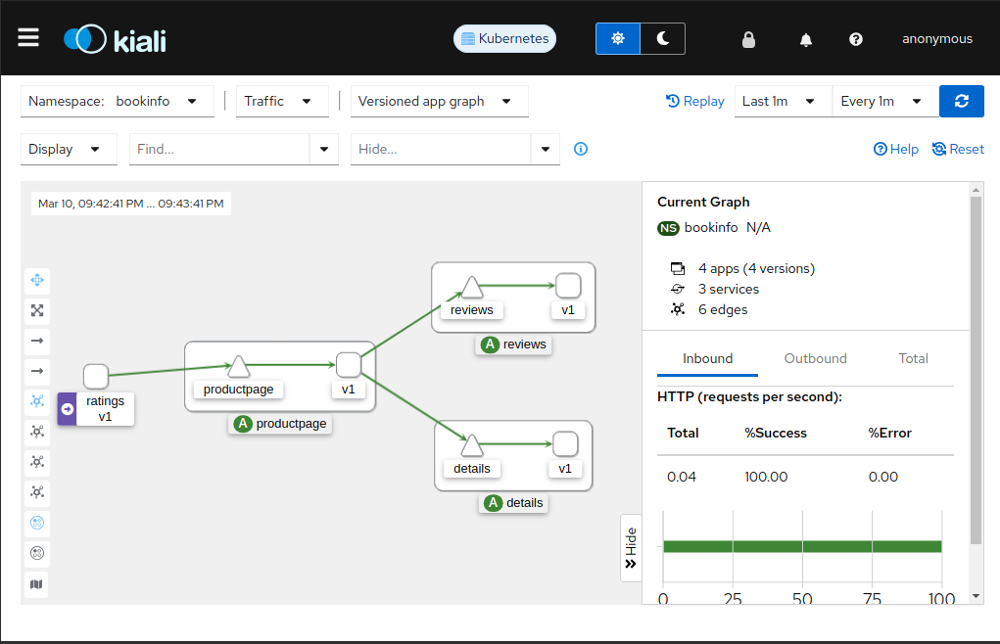

Run Kiali on kind

This repo assumes you are using linux and have brew installed.

Tested with 

kind version
```
kind v0.22.0 go1.21.7 linux/amd64
```

istioctl version
```
client version: 1.20.3
control plane version: 1.20.3
data plane version: 1.20.3 (9 proxies)
```

in ./samples/addons/kiali.yaml 
find the external_services to add the text
below istio

Istio does not be default add the connection to grafana so it must be added manually below line 96.

snippet
```
      grafana:
        in_cluster_url: http://grafana.istio-system:3000
        url: http://127.0.0.1/grafana
```

full change
```
    external_services:
      custom_dashboards:
        enabled: true
      istio:
        root_namespace: istio-system
      grafana:
        in_cluster_url: http://grafana.istio-system:3000
        url: http://127.0.0.1/grafana
```

In browser: 
[kiali dashboard](http://127.0.0.1:20001)




Read Makefile for commands

